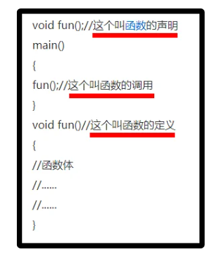

# C++笔记

## 知识点

- 不管有多少个cpp文件，一个项目中只能同时存在一个main函数。而不管这个main在哪一个cpp中。
- 

## 问题1

**typedef enum COLOR{GREEN ,RED,YELLOW} color;这段C++代码什么意思**

这段 C++ 代码定义了一个名为 `color` 的枚举类型，并将 `GREEN`、`RED` 和 `YELLOW` 作为该枚举类型的枚举常量。

枚举类型是一种特殊的整型类型，它可以用来定义命名的常量。例如，通过定义上面的枚举类型，我们可以定义一个名为 `color c` 的变量，并为其赋值为 `GREEN`、`RED` 或 `YELLOW`。

下面是一个简单的示例，展示了如何使用上面定义的枚举类型：

```c++
Copy code
#include <iostream>
using namespace std;

typedef enum COLOR{GREEN ,RED,YELLOW} color; // 定义枚举类型

int main()
{
    color c = GREEN; // 定义枚举类型变量并赋初值
    cout << c << endl; // 输出枚举类型变量的值
    return 0;
}
```

上面的代码会输出 `0`，因为 `GREEN` 的值为 `0`。

注意，在 C++11 之前，枚举类型的定义方式与上面稍有不同，它应该写成下面这样：

```c++
Copy code
enum COLOR{GREEN ,RED,YELLOW};
typedef enum COLOR color;
```

上面的代码将定义一个名为 `COLOR` 的枚举类型，并使用 `typedef` 将其定义为名为 `color` 的新类型。

## 问题2

**C++中，函数的声明与函数的定义有什么区别？**

函数的声明与函数的定义的区别：

声明：一般在头文件里，对编译器说：这里我有一个函数叫function() 让编译器知道这个函数的存在。

定义：一般在源文件里，具体就是函数的实现过程 写明函数体。

你还可以这样理解：

首先下图中的程序执行时，电脑是从上到下执行的。

也就是说假如没有函数的声明那一句，当函数执行到函数调用这一句时，电脑不知道fun是什么东西，他不知道在下面有这个函数的具体实现。

因此，需要声明下，告诉电脑，确实有这个东西存在，是函数，在下面有定义。



## 问题3

**C++中extern关键字的使用**

> https://blog.csdn.net/qq_45477402/article/details/124337675

extern是c++引入的一个关键字，它可以应用于一个全局变量，函数或模板声明，说明该符号具有外部链接(external linkage)属性。也就是说，这个符号在别处定义。一般而言，C++全局变量的作用范围仅限于当前的文件，但同时C++也支持分离式编译，允许将程序分割为若干个文件被独立编译。于是就需要在文件间共享数据，这里extern就发挥了作用。

　在介绍extern之前，我们需要了解一下变量的声明和定义。变量的声明指向程序表名变量的类型和名字，即使得名字为程序所知，一个文件如果想使用别处定义的名字则必须包含对那个名字的声明。而变量的定义指申请存储空间，并将其与变量名相关联，除此之外，还可以为变量指定初始值。在程序中变量可以声明多次，但只能定义一次。一般而言，定义就是声明。但C++中由于extern的缘故，变量的声明和定义是可以分开的。凡是没有带extern的声明同时也都是定义。而对函数而言，带有{}是定义，否则是声明。如果想声明一个变量而非定义它，就在变量名前添加关键字extern，且不要显式的初始化变量。

## 问题4

**gcc与g++的区别**

> https://blog.csdn.net/wuzheyan2008/article/details/119715526
>
> https://www.zhihu.com/question/20940822/answer/536826078

首先说明：gcc 和 GCC 是两个不同的东西

GCC:GNU Compiler Collection(GUN 编译器集合)，它可以编译C、C++、JAV、Fortran、Pascal、Object-C、Ada等语言。

gcc是GCC中的GUN C Compiler（C 编译器）

[g++](https://www.zhihu.com/search?q=g%2B%2B&search_source=Entity&hybrid_search_source=Entity&hybrid_search_extra=%7B%22sourceType%22%3A%22answer%22%2C%22sourceId%22%3A536826078%7D)是GCC中的GUN C++ Compiler（C++编译器）

一个有趣的事实就是，就本质而言，gcc和g++并不是编译器，也不是编译器的集合，它们只是一种驱动器，根据参数中要编译的文件的类型，调用对应的GUN编译器而已，比如，用gcc编译一个c文件的话，会有以下几个步骤：

Step1：Call a [preprocessor](https://www.zhihu.com/search?q=preprocessor&search_source=Entity&hybrid_search_source=Entity&hybrid_search_extra=%7B%22sourceType%22%3A%22answer%22%2C%22sourceId%22%3A536826078%7D), like cpp.

Step2：Call an actual compiler, like cc or cc1.

Step3：Call an assembler, like as.

Step4：Call a linker, like ld

由于编译器是可以更换的，所以gcc不仅仅可以编译C文件

所以，更准确的说法是：**gcc调用了C compiler，而g++调用了C++ compiler**

gcc和g++的主要区别

\1. 对于 *.c和*.cpp文件，gcc分别当做c和cpp文件编译（c和cpp的语法强度是不一样的）

\2. 对于 *.c和*.cpp文件，g++则统一当做[cpp文件](https://www.zhihu.com/search?q=cpp%E6%96%87%E4%BB%B6&search_source=Entity&hybrid_search_source=Entity&hybrid_search_extra=%7B%22sourceType%22%3A%22answer%22%2C%22sourceId%22%3A536826078%7D)编译

\3. 使用g++编译文件时，**g++会自动链接标准库STL，而gcc不会自动链接STL**

\4. gcc在编译C文件时，可使用的预定义宏是比较少的

\5. gcc在编译cpp文件时/g++在编译c文件和cpp文件时（这时候gcc和g++调用的都是cpp文件的编译器），会加入一些额外的宏，这些宏如下：

#define __GXX_WEAK__ 1
#define __cplusplus 1
#define __DEPRECATED 1
#define __GNUG__ 4
#define __EXCEPTIONS 1
#define __private_extern__ extern

\6.        在用gcc编译c++文件时，为了能够使用STL，需要加参数 –lstdc++ ，但这并不代表 gcc –lstdc++ 和 g++等价。